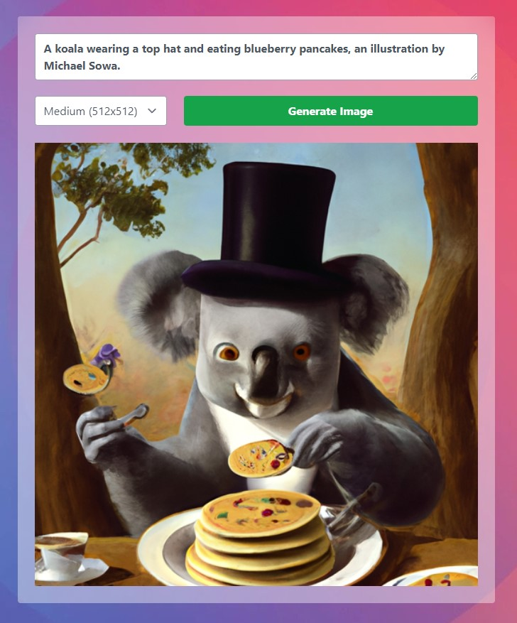

# Text-to-Image Generator

Text-to-image generator using the [Dall-E 2 deep learning model](https://openai.com/dall-e-2/) developed by OpenAI.

[Click here to view app](https://openai-image-generator-react-frontend.onrender.com/)

Styled with [Tailwind CSS](https://tailwindcss.com/) and deployed with [Render](https://render.com/)

Here are some [prompt ideas](https://mpost.io/top-50-text-to-image-prompts-for-ai-art-generators-midjourney-and-dall-e/) to get you started!